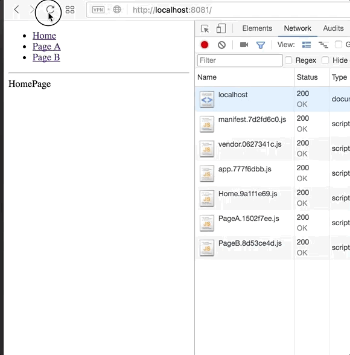

Webpack lazy load chunks issue.

- Clone the repo `git clone git@github.com:vkbansal/webpack-lazy-load-chunks.git`
- `cd webpack-lazy-load-chunks.git`
- `npm install`
- `npm run build`
- Start local HTTP server `cd docs && python -m SimpleHTTPServer [port]` or use [http-server](https://github.com/nodeapps/http-server)

All the chunks are loaded at start.

